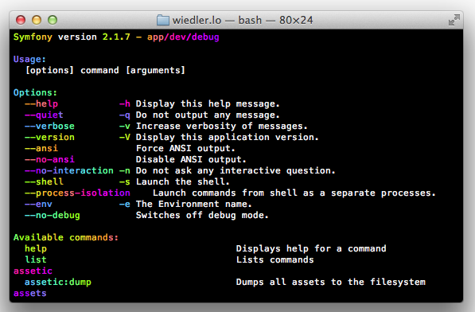

# Fab Symfony Console

Make symfony console output **FABULOUS!**

Powered by the fantastic [fab](https://github.com/whatthejeff/fab).

## Sample output

## Usage

    $input = new ArgvInput();

    $output = new ConsoleOutput();
    $output->setFormatter(new OutputFormatter(true, [
        'info'      => new FabOutputFormatterStyle(),
        'comment'   => new FabOutputFormatterStyle(),
    ]));

    $app->run($input, $output);
